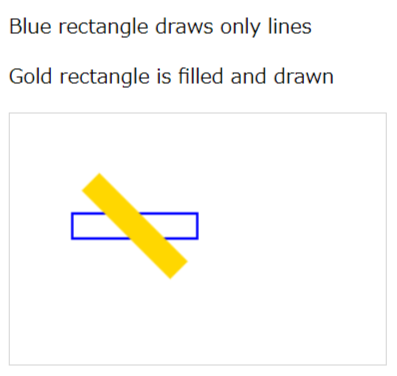

# Changelog

All notable changes to this project will be documented in this file.
The format is based on [Keep a Changelog](https://keepachangelog.com/).

## [1.0.5] - 2026-03-06

### Changed

- Improve README with features table, usage examples, and organized API reference
- Improve JSDoc across all modules for better IDE autocompletion and documentation

## [1.0.4] - 2020-12-21

### Added

- **Clipboard** module — async clipboard write support

```js
import { Clipboard } from 'js-shared';

await Clipboard.save('Hello, World!');
```

## [1.0.3] - 2020-09-04

### Added

- `fill` option for `Graphics.drawRectangle` — solid fills with optional rotation



```js
import { Graphics } from 'js-shared';

const canvas = document.querySelector('#myCanvas');

// Stroke only
Graphics.drawRectangle(canvas, 50, 80, 100, 20, {
  lineColor: 'blue',
});

// Filled & rotated
Graphics.drawRectangle(canvas, 50, 80, 100, 20, {
  fill: 'gold',
  degree: 45,
  lineWidth: 0,
});
```

## [1.0.2] - 2020-07-20

### Added

- **Cookie** module — simple get / set / remove for browser cookies

## [1.0.1] - 2020-07-20

### Fixed

- README typos

### Added

- This changelog

## [1.0.0] - 2020-07-20

Initial release.
