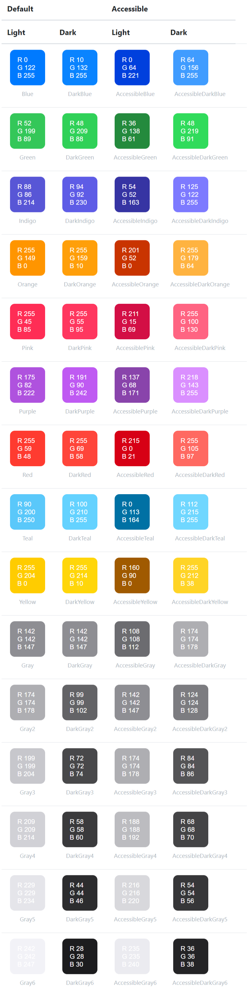

# js-shared

> Lightweight JavaScript / TypeScript utility toolkit for browser & Node.js

[](https://www.npmjs.com/package/js-shared)
[](./LICENSE)

## Features

| Module | Description |
|--------|------------|
| **Browser** | User-agent detection — platform, OS, browser |
| **Clipboard** | Async clipboard read / write |
| **Collection** | Array helpers (dedup, etc.) |
| **Color** | System-aware color palette |
| **Cookie** | Simple cookie CRUD |
| **Date** | Formatting, ranges, arithmetic, validation |
| **Graphics** | Canvas drawing utilities |
| **Misc** | Runtime detection & globals |
| **Random** | Integers, sampling, HSL color generation |
| **Template** | Handlebars-based HTML templating |
| **Types** | Type checking helpers |

## Installation

```sh
npm install js-shared
```

## Quick Start

```js
import { Browser, Collection, Date } from 'js-shared';

// Detect the current browser
const info = Browser.parse(navigator.userAgent);
console.log(info.browserName); // => 'Chrome'

// Remove duplicates
Collection.unique(['a', 'b', 'a']); // => ['a', 'b']

// Format today's date
Date.format('YYYY-MM-DD'); // => '2020-03-20'
```

## API

### Browser

Detect platform, OS and browser from the user-agent string.

```js
import { Browser } from 'js-shared';

Browser.parse(navigator.userAgent);
// => { platform: 'mobile', osName: 'Android', osVersion: 9, browserName: 'Chrome' }
```

### Clipboard

Read from and write to the system clipboard.

```js
import { Clipboard } from 'js-shared';

await Clipboard.save('Hello, World!');
```

### Collection

Handy array operations.

```js
import { Collection } from 'js-shared';

Collection.unique(['green', 'red', 'green', 'blue', 'red']);
// => ['green', 'red', 'blue']
```

### Color

System-aware color values that adapt to accessibility settings.



```js
import { Color } from 'js-shared';

Color.blue;               // rgb(0,122,255)
Color.darkBlue;            // rgb(10,132,255)
Color.accessibleBlue;      // rgb(0,64,221)
Color.accessibleDarkBlue;  // rgb(64,156,255)
```

### Cookie

Simple cookie management.

```js
import { Cookie } from 'js-shared';

Cookie.set('token', 'abc123');
Cookie.get('token'); // => 'abc123'
Cookie.remove('token');
```

### Date

Full-featured date utilities — formatting, ranges, arithmetic, and validation.

```js
import { Date } from 'js-shared';
```

#### Format

```js
Date.format();
// => '2020-03-20T12:17:34+09:00'

Date.format('dddd, MMMM Do YYYY, h:mm:ss a');
// => 'Friday, March 20th 2020, 12:17:34 pm'

Date.format('2020-01-01', 'ddd, hA');
// => 'Wed, 12AM'
```

#### Time slots

```js
Date.timesOneDay();
// => ['00:00', '01:00', ... '23:00', '00:00']

Date.timesOneDay(9, 'LT');
// => ['9:00 AM', '10:00 AM', ... '8:00 AM', '9:00 AM']
```

#### Days in month

```js
Date.daysInMonth();
// => ['1', '2', ... '31']

Date.daysInMonth('2020-01', 'MMM D');
// => ['Jan 1', 'Jan 2', ... 'Jan 31']
```

#### Range

Generate consecutive dates at regular intervals.

```js
Date.range(7, 'days', '3/1', '3/31', 'M/D');
// => ['3/1', '3/8', '3/15', '3/22', '3/29']

Date.range(30, 'minutes', '3/1, 9:00', '3/1, 12:00', 'H:mm');
// => ['9:00', '9:30', '10:00', '10:30', '11:00', '11:30', '12:00']
```

#### Arithmetic

```js
Date.add('2020/3/21', 1, 'months', 'M/D/Y');      // => '4/21/2020'
Date.add('2020/3/21', 1, 'weeks',  'M/D/Y');      // => '3/28/2020'
Date.add('2020/3/21, 9:00:00', 1, 'hours', 'M/D/Y, H:mm:ss');
// => '3/21/2020, 10:00:00'

Date.subtract('2020/3/21', 7, 'days', 'M/D/Y');   // => '3/14/2020'
```

#### Validation

```js
Date.isValid('2012-05-25', 'YYYY-MM-DD', true); // => true
Date.isValid('2012.05.25', 'YYYY-MM-DD', true); // => false
Date.isValid('2010 2 29',  'YYYY MM DD');        // => false (not a leap year)
```

### Graphics

Canvas drawing utilities.


```js
import { Graphics } from 'js-shared';

const canvas = document.querySelector('#myCanvas');

// Stroke only
Graphics.drawRectangle(canvas, 50, 80, 100, 20, {
  lineColor: 'blue',
});

// Filled & rotated
Graphics.drawRectangle(canvas, 50, 80, 100, 20, {
  fill: 'gold',
  degree: 45,
  lineWidth: 0,
});
```

### Misc

Runtime environment helpers.

```js
import { Misc } from 'js-shared';

Misc.isNodeEnvironment(); // => false (in browser)
Misc.getGlobal();         // => window | global
```

### Random

Random number generation, sampling, and color creation.

```js
import { Random } from 'js-shared';

Random.randInt(3, 9);                  // integer between 3-9
Random.sample(['apple', 'banana']);     // random pick

// Vibrant colors
Random.randHSL({ smin: 80, smax: 100, lmin: 45, lmax: 55 });

// Soft pastels
Random.randHSL({ smin: 10, smax: 100, lmin: 50, lmax: 95 });
```

### Template

Handlebars-powered template engine with built-in helpers.

```js
import { Template } from 'js-shared';
```

#### Basic interpolation

```js
Template.compile(`
  <p>Hello, my name is {{name}}.</p>
  <ul>
    {{#kids}}<li>{{name}} is {{age}}</li>{{/kids}}
  </ul>
`)({ name: 'Alan', kids: [{ name: 'Jimmy', age: '12' }, { name: 'Sally', age: '4' }] });
```

#### Conditionals

```js
Template.compile(`
  {{#if author}}
    <h1>{{firstName}} {{lastName}}</h1>
  {{else}}
    <h1>Unknown Author</h1>
  {{/if}}
`)({ author: true, firstName: 'Yehuda', lastName: 'Katz' });
// => '<h1>Yehuda Katz</h1>'
```

#### Iteration

```js
// Array of strings
Template.compile(`
  <ul>
    {{#each people}}<li>{{this}}</li>{{/each}}
  </ul>
`)({ people: ['Yehuda Katz', 'Alan Johnson', 'Charles Jolley'] });

// Array of objects
Template.compile(`
  <ul>
    {{#each persons}}<li>{{name}} ({{country}})</li>{{/each}}
  </ul>
`)({ persons: [{ name: 'Nils', country: 'Germany' }, { name: 'Yehuda', country: 'USA' }] });
```

#### HTML escaping

```js
Template.compile('raw: {{{specialChars}}} | escaped: {{specialChars}}')({
  specialChars: '& < > " \' ` =',
});
// => 'raw: & < > " \' ` = | escaped: &amp; &lt; &gt; ...'
```

#### Math helpers — `round` / `ceil` / `floor`

```js
Template.compile('{{round value}}')({ value: 1.5 });     // => '2'
Template.compile('{{ceil 2 value}}')({ value: 1.014 });   // => '1.02'
Template.compile('{{floor 2 value}}')({ value: 1.016 });  // => '1.01'
```

#### Comparison operators

`eq` `ne` `lt` `gt` `le` `ge` `and` `or`

```js
Template.compile('{{#if (gt value 10)}}big{{else}}small{{/if}}')({ value: 3 });
// => 'small'

Template.compile('{{#if (and value1 value2)}}both{{else}}nope{{/if}}')({
  value1: true, value2: false,
});
// => 'nope'
```

#### Moment helpers

```js
Template.compile('{{moment}}')();
// => '2020-07-20T03:34:29+09:00'

Template.compile('{{moment d "DD/MM/YYYY"}}')({ d: '7/21/2020' });
// => '21/07/2020'

Template.compile('{{moment d add="days" amount="7"}}')({ d: '7/21/2020' });
// => '2020-07-28T00:00:00+09:00'

Template.compile('{{moment d "fromNow"}}')({ d: '7/20/2020' });
// => '4 hours ago'
```

### Types

Runtime type checking.

```js
import { Types } from 'js-shared';

async function myAsyncFn() {}
function myFn() {}

Types.isAsync(myFn);      // => false
Types.isAsync(myAsyncFn); // => true
```

## Changelog

See [CHANGELOG.md](./CHANGELOG.md) for release history.

## License

[MIT](./LICENSE)
